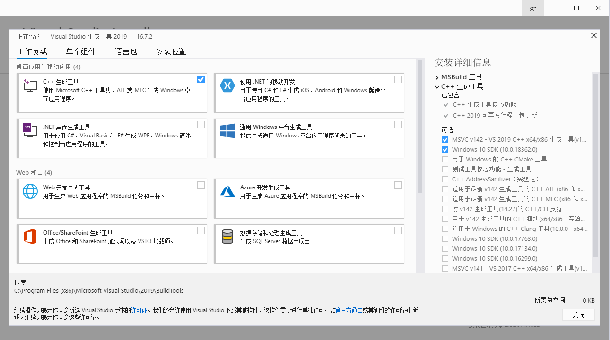
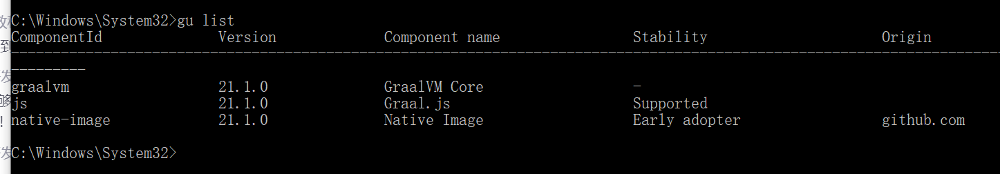

# 1. 安装 Graalvm #
## 第一步 ##
去官网下载，有两个版本，一个是社区版，一个是企业版，选择社区版（Community）
选择社区版会跳到github里去下载 [社区版各版本下载地址](https://github.com/graalvm/graalvm-ce-builds/tags)

有 jdk8 和 jdk11 的版本，选择自己喜欢的下载，这里注意版本对应的插件版本也要自己去查


## 第二步 ##
配置 JAVA_HOME，略...

## 第三步 编译环境安装 windows ##

下载Microsoft C++生成工具 vs_buildtools_xxx.exe，选择 C++生成工具



## 第四步 环境变量不要忘了 ##
```text
INCLUDE=C:\Program Files (x86)\Windows Kits\10\Include\10.0.17134.0\ucrt;C:\Program Files (x86)\Windows Kits\10\Include\10.0.17134.0\um;C:\Program Files (x86)\Windows Kits\10\Include\10.0.17134.0\shared;D:\Program Files (x86)\Microsoft Visual Studio\2019\Community\VC\Tools\MSVC\14.16.27023\include.;
LIB=C:\Program Files (x86)\Windows Kits\10\Lib\10.0.17134.0\um\x64;C:\Program Files (x86)\Windows Kits\10\Lib\10.0.17134.0\ucrt\x64;D:\Program Files (x86)\Microsoft Visual Studio\2019\Community\VC\Tools\MSVC\14.16.27023\lib\x64;
PATH=%PATH%;D:\Program Files (x86)\Microsoft Visual Studio\2019\Community\VC\Tools\MSVC\14.16.27023\bin\HostX64\x64
```
10.0.17134.0 为版本号，根据自己装的版本替换


## 第五步 ##
然后安装GraalVM插件
命令行：
* gu install native-image
* gu list




## spring boot 2.4 增加的插件 ##
见 pom: native-image-maven-plugin


## command ##
```text
mvn clean package -P native
```

# 相关文档 #

* [spring native](https://docs.spring.io/spring-native/docs/current/reference/htmlsingle/#getting-started-native-image)
* [spring blog](https://spring.io/blog/2020/06/16/spring-tips-spring-and-graalvm-pt-2)